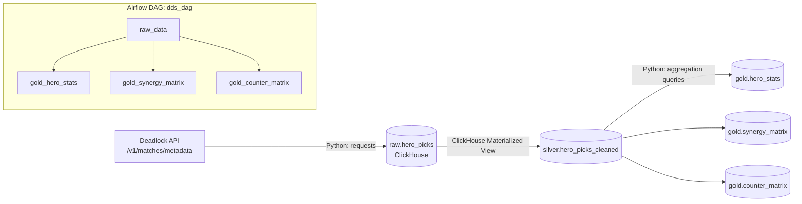

# Deadlock Draft Simulator — Data Pipeline

An ETL pipeline that turns raw match data from the public [Deadlock](https://deadlock-api.com) game API into analytics-ready hero statistics — win rates, pick rates, hero synergies, and counter matchups — meant to power a draft-assistant tool.

The project follows a **medallion (raw → silver → gold) architecture** on top of **ClickHouse**, orchestrated with **Apache Airflow**, with schema managed as code via **dbmate** migrations.

> Portfolio project focused on data engineering fundamentals: layered warehouse modeling, idempotent batch ingestion, SQL-based transformations, DAG orchestration, and infra-as-code with Docker Compose.

## Architecture



**Layers**

| Layer | Storage | Built with | Purpose |
|---|---|---|---|
| **Raw** | `raw.hero_picks` (ReplacingMergeTree) | Python (`etl/raw`) | One row per player-per-match, fetched incrementally from the Deadlock API and inserted as-is |
| **Silver** | `silver.hero_picks_cleaned` | ClickHouse Materialized View (`db/migrations`) | Deduplicated/cleaned copy of raw, kept in sync automatically on every insert — no Python needed |
| **Gold** | `gold.hero_stats`, `gold.synergy_matrix`, `gold.counter_matrix` | Python (`etl/gold`) | Pre-aggregated analytics: per-hero win/pick rate, same-team pair win rate, opposing-pair win rate |

Ingestion is **incremental**: each raw run reads `MAX(match_id)` already stored in ClickHouse and only pulls newer matches from the API.

## Tech stack

- **Database:** [ClickHouse](https://clickhouse.com/) — column store, `ReplacingMergeTree` tables partitioned by month
- **Orchestration:** [Apache Airflow 3](https://airflow.apache.org/) (`CeleryExecutor`, Redis broker, Postgres metadata DB), TaskFlow API DAG
- **Migrations:** [dbmate](https://github.com/amacneil/dbmate) — versioned SQL migrations, no ORM
- **Python:** `clickhouse-connect`, `requests`, `pydantic-settings`
- **Infra:** Docker Compose (separate stacks for the warehouse and for Airflow)

## Project structure

```
etl/
  clients/
    api/deadlock_api_client.py   # Deadlock API HTTP client
    db/clickhouse_client.py      # thread-safe singleton ClickHouse client
  config/config.py               # pydantic-settings, loads .env
  raw/
    extract_api_data.py          # parse & flatten API response into rows
    load.py                      # insert rows into raw.hero_picks
  silver/                        # transform lives in SQL (materialized view), not here
  gold/
    extract_silver_data.py       # aggregation queries per gold table
    transform.py                 # QueryResult -> list[dict]
    load.py                      # insert into gold.* tables
  pipelines/
    raw_pipeline.py               # orchestrates raw extract -> load
    gold_hero_stats_pipeline.py
    gold_synergy_matrix_pipeline.py
    gold_counter_matrix_pipeline.py
dags/
  dds_dag.py                      # Airflow DAG wiring the pipelines above
db/
  migrations/                     # dbmate SQL migrations (raw/silver/gold DDL + the MV)
  schema.sql                      # consolidated schema, generated by dbmate
docker-compose.yml                # ClickHouse + dbmate (migration runner)
docker-compose.airflow.yml        # Airflow (apiserver, scheduler, worker, triggerer, postgres, redis)
Makefile                          # local dev shortcuts
```

## Gold layer data model

| Table | Grain | Key columns |
|---|---|---|
| `gold.hero_stats` | one row per hero | `win_rate`, `pick_rate`, `winning_games`, `total_games` |
| `gold.synergy_matrix` | one row per **same-team** hero pair | `win_rate` when both heroes are picked together |
| `gold.counter_matrix` | one row per **opposing** hero pair | `win_rate_hero1` / `win_rate_hero2` when the two heroes face each other |

All gold tables use `ReplacingMergeTree(calculated_at)`, so pipelines are safe to re-run — reprocessing simply replaces the previous snapshot.

## Getting started

Requires Docker and Docker Compose.

```bash
git clone <this-repo>
cd dds

# 1. create .env from the template and fill in ClickHouse creds
make init

# 2. shared network used by both compose stacks
docker network create dds_shared_network

# 3. start ClickHouse
make up

# 4. apply schema migrations
make migrate

# 5. start Airflow (separate stack)
docker compose -f docker-compose.airflow.yml up -d
```

Airflow UI: http://localhost:8080 (default `airflow` / `airflow`). Unpause `dds_dag` to run it on its daily schedule, or trigger it manually.

Useful Makefile targets:

| Command | Description |
|---|---|
| `make up` / `make down` | start / stop ClickHouse (`down` also drops volumes) |
| `make migrate` | apply pending dbmate migrations |
| `make migrate-new name=...` | scaffold a new migration |
| `make ch` | open a ClickHouse CLI shell |
| `make logs` | tail ClickHouse logs |

## Configuration

Settings are loaded from `.env` via `pydantic-settings` (see `etl/config/config.py`). Key variables (full list in `.env.example`):

| Variable | Description |
|---|---|
| `DEADLOCK_API_BASE_URL` | Base URL of the Deadlock public API |
| `CLICKHOUSE_USER` / `CLICKHOUSE_PASSWORD` / `CLICKHOUSE_DB` / `CLICKHOUSE_PORT` | Used by the `clickhouse` and `dbmate` containers |
| `CLICKHOUSE__CLICKHOUSE_HOST` / `..._PORT` / `..._USER` / `..._PASSWORD` / `..._SECURE` | Nested settings consumed by the Python ETL client |
| `FERNET_KEY` | Airflow's Fernet key for encrypting connections/variables |

## Known limitations / roadmap

Left intentionally visible as this is a work-in-progress portfolio build:

- No caching of `last_match_id` between runs yet — it's recomputed from ClickHouse each time (a Redis cache is planned, see `TODO` in `raw_pipeline.py`)
- No retry/backoff on transient ClickHouse insert failures (`TODO` in `raw/load.py`, `gold/load.py`)
- No automated tests yet
- No downstream consumer app included in this repo — the gold tables are designed to be queried by a future draft-simulator frontend/API

---

## Русская версия

Пайплайн данных для **Deadlock Draft Simulator**: превращает сырые данные о матчах из публичного API игры [Deadlock](https://deadlock-api.com) в готовую для аналитики статистику по героям — винрейт, пикрейт, синергии пар героев и контр-пики.

Реализована **медальонная архитектура (raw → silver → gold)** поверх **ClickHouse**, оркестрация через **Apache Airflow**, схема БД версионируется миграциями **dbmate**.

**Слои:**
- **raw** — данные из API, вставляются как есть (Python, инкрементально по `match_id`)
- **silver** — материализованное представление ClickHouse поверх raw (чистка/дедупликация делается на уровне SQL, без Python)
- **gold** — три агрегирующих таблицы (`hero_stats`, `synergy_matrix`, `counter_matrix`), считаются Python-пайплайнами и грузятся в ClickHouse

DAG `dds_dag` в Airflow запускает `raw_data`, а затем параллельно три gold-пайплайна.

Инструкция по запуску — в разделе **Getting started** выше (команды одинаковы для обеих версий README).
